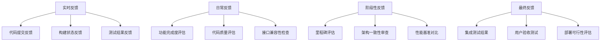

# 开发反馈机制与日志系统

## 🎯 系统概述

**目标**: 建立 Claude Code 和 Cursor AI 之间高效的协作反馈机制，确保开发质量和进度可控  
**适用范围**: 整个后端开发生命周期  
**核心原则**: 透明、及时、建设性、可追溯

## 📋 目录

1. [反馈机制设计](#反馈机制设计)
2. [开发日志规范](#开发日志规范)
3. [代码审查流程](#代码审查流程)
4. [问题追踪系统](#问题追踪系统)
5. [性能评估标准](#性能评估标准)
6. [沟通协议](#沟通协议)
7. [自动化工具](#自动化工具)
8. [改进建议流程](#改进建议流程)

---

## 🔄 反馈机制设计

### 反馈层级结构



### 反馈评分体系

```yaml
代码质量评分:
  优秀 (9-10分):
    - 代码风格完全一致
    - 注释完整且准确
    - 测试覆盖率 > 90%
    - 无安全隐患
    - 性能优异

  良好 (7-8分):
    - 代码风格基本一致
    - 核心功能有注释
    - 测试覆盖率 > 75%
    - 无关键安全问题
    - 性能良好

  一般 (5-6分):
    - 代码风格有偏差
    - 部分功能缺少注释
    - 测试覆盖率 > 60%
    - 有轻微安全问题
    - 性能可接受

  需改进 (3-4分):
    - 代码风格不一致
    - 注释严重不足
    - 测试覆盖率 < 60%
    - 存在安全隐患
    - 性能问题明显

  不合格 (1-2分):
    - 代码风格混乱
    - 几乎无注释
    - 测试覆盖率 < 40%
    - 严重安全问题
    - 性能不可接受

功能完成度评分:
  完全实现 (10分): 所有功能按规范实现，边界情况处理完善
  基本实现 (8分): 核心功能实现，部分边界情况待处理
  部分实现 (6分): 主要功能实现，次要功能缺失
  初步实现 (4分): 基础功能实现，大量功能待开发
  未实现 (2分): 仅有框架代码，核心功能未实现
```

---

## 🚀 开发工作流与分支策略

### 分支管理规范

```yaml
分支策略:
  main:
    - 生产就绪的稳定版本
    - 受保护分支，需要PR审查
    - 自动部署到生产环境

  develop:
    - 开发主分支
    - 所有功能分支的基础
    - 自动部署到测试环境

  feature/*:
    - 功能开发分支
    - 命名: feature/<module>-<feature-name>
    - 示例: feature/rideshare-api, feature/points-system
    - 完成后合并到develop

  hotfix/*:
    - 紧急修复分支
    - 从main创建，修复后合并回main和develop
    - 命名: hotfix/<issue-description>

  release/*:
    - 发布准备分支
    - 从develop创建，准备发布版本
    - 命名: release/<version>
```

### Pull Request 工作流程

```yaml
PR创建规范:
  标题格式: "[模块名] 功能描述"

  描述模板:
    ## 📋 变更概述
    简要描述本次PR的主要变更内容

    ## ✅ 完成的功能
    - [ ] 功能1描述
    - [ ] 功能2描述
    - [ ] 功能3描述

    ## 🧪 测试说明
    ### 如何手动测试
    1. 步骤1
    2. 步骤2
    3. 预期结果

    ### 自动化测试
    - 单元测试覆盖率: XX%
    - 集成测试通过: ✅/❌

    ## 📝 API文档更新
    - [ ] 更新了API文档
    - [ ] 更新了Postman集合
    - [ ] 更新了使用示例

    ## ⚠️ 注意事项
    - 数据库迁移: 有/无
    - 环境变量变更: 有/无
    - 破坏性变更: 有/无
    - 依赖更新: 有/无

    ## 🔗 相关Issue
    Closes #123

PR审查清单:
  代码质量:
    - [ ] 代码风格符合规范
    - [ ] 无明显代码异味
    - [ ] 注释完整清晰
    - [ ] 无调试代码残留

  功能完整性:
    - [ ] 功能符合需求
    - [ ] 边界情况处理
    - [ ] 错误处理完善
    - [ ] 日志记录合理

  测试覆盖:
    - [ ] 单元测试充分
    - [ ] 集成测试通过
    - [ ] 手动测试验证
    - [ ] 性能测试（如需要）

  安全性:
    - [ ] 无安全漏洞
    - [ ] 输入验证完整
    - [ ] 权限控制正确
    - [ ] 敏感信息处理

  文档更新:
    - [ ] API文档同步
    - [ ] 代码注释完整
    - [ ] README更新
    - [ ] 变更日志更新
```

### 交叉测试协议

```yaml
测试分配:
  模块1代码 (Claude Code开发):
    - 审查者: Cursor AI
    - 测试重点: API兼容性、积分系统集成、通知服务调用

  模块2代码 (Cursor AI开发):
    - 审查者: Claude Code
    - 测试重点: 用户认证、基础架构稳定性、数据一致性

  共享代码:
    - 双方都需审查
    - 重点: 接口契约、数据格式、错误处理

测试执行流程:
  1. 拉取功能分支:
     git checkout -b feature/<branch-name> origin/feature/<branch-name>

  2. 安装依赖并配置环境:
     npm install
     cp .env.example .env
     # 配置必要的环境变量

  3. 运行自动化测试:
     npm run test           # 单元测试
     npm run test:integration # 集成测试
     npm run test:coverage   # 覆盖率报告

  4. 手动测试:
     - 导入Postman集合
     - 按照PR描述执行测试步骤
     - 记录测试结果

  5. 性能测试（如需要）:
     npm run test:performance

  6. 记录反馈:
     - 在PR中添加评论
     - 更新development-feedback-system.md
     - 标记问题严重程度
```

---

## 📝 开发日志规范

### 日志文件结构

```
logs/
├── daily/
│   ├── claude-code/
│   │   ├── 2024-06-30.md
│   │   ├── 2024-07-01.md
│   │   └── ...
│   └── cursor-ai/
│       ├── 2024-06-30.md
│       ├── 2024-07-01.md
│       └── ...
├── weekly/
│   ├── week-26-2024.md
│   ├── week-27-2024.md
│   └── ...
├── milestones/
│   ├── module1-auth-system.md
│   ├── module1-activity-system.md
│   ├── module2-rideshare-system.md
│   └── ...
└── issues/
    ├── integration-issues.md
    ├── performance-issues.md
    └── security-issues.md
```

### 日志模板

#### 每日开发日志模板

```markdown
# 开发日志 - [日期] - [开发者]

## 📊 当日概览

- **工作时间**: [开始时间] - [结束时间]
- **主要任务**: [简要描述当日主要任务]
- **完成状态**: [进度百分比]
- **遇到问题**: [是/否，如有请详细说明]

## ✅ 完成任务

### 1. [任务名称]

- **详细描述**:
- **实现方案**:
- **代码文件**:
- **测试状态**:
- **备注**:

### 2. [任务名称]

- **详细描述**:
- **实现方案**:
- **代码文件**:
- **测试状态**:
- **备注**:

## 🚧 进行中任务

### [任务名称]

- **当前进度**: [百分比]
- **预计完成时间**:
- **依赖项**:
- **阻塞因素**:

## ❗ 遇到的问题

### 问题 1: [问题标题]

- **问题描述**:
- **影响范围**:
- **尝试的解决方案**:
- **当前状态**: [已解决/待解决/需协助]
- **需要的帮助**:

## 🔍 代码审查情况

### 审查他人代码

- **审查的文件/模块**:
- **发现的问题**:
- **改进建议**:
- **评分**: [1-10 分]

### 接受他人审查

- **被审查的文件/模块**:
- **收到的反馈**:
- **改进计划**:

## 🧪 测试情况

- **新增测试**:
- **测试通过率**:
- **失败的测试**:
- **测试覆盖率**:

## 📈 性能指标

- **API 响应时间**:
- **数据库查询性能**:
- **内存使用情况**:
- **发现的性能问题**:

## 🔗 接口协调

- **新增的接口**:
- **修改的接口**:
- **接口文档更新**:
- **与对方模块的集成状态**:

## 📝 明日计划

- [ ] [具体任务 1]
- [ ] [具体任务 2]
- [ ] [具体任务 3]

## 💭 反思与建议

- **今日学到的经验**:
- **可以改进的地方**:
- **对项目的建议**:
- **对协作的建议**:

---

**日志提交时间**: [时间戳]
**代码提交 Hash**: [Git 提交哈希]
**相关 Issue**: [关联的 Issue 编号]
```

#### 周报模板

```markdown
# 周报 - 第[周数]周 (2024 年[月份]) - [开发者]

## 📊 周度总结

- **工作日数**: [实际工作天数]
- **总工作时间**: [小时数]
- **主要成就**:
- **遇到的挑战**:
- **学习收获**:

## 🎯 目标达成情况

### 计划目标

- [ ] [目标 1] - [完成度百分比]
- [ ] [目标 2] - [完成度百分比]
- [ ] [目标 3] - [完成度百分比]

### 超额完成

- [额外完成的任务]

### 未完成任务及原因

- [任务] - [原因]

## 📈 数据统计

### 代码贡献

- **新增代码行数**:
- **修改代码行数**:
- **删除代码行数**:
- **提交次数**:
- **主要文件**:

### 测试情况

- **新增测试用例**:
- **测试覆盖率**:
- **修复的 Bug**:
- **发现的新问题**:

### 代码审查

- **审查他人代码**: [次数]
- **接受他人审查**: [次数]
- **平均审查分数**:
- **主要反馈类型**:

## 🔗 协作情况

### 与对方开发者的协作

- **沟通频次**:
- **协作效果**: [1-10 分]
- **主要协作内容**:
- **协作中的问题**:

### 接口对接情况

- **完成的接口对接**:
- **待对接的接口**:
- **接口兼容性问题**:

## 📊 质量指标

### 代码质量

- **代码风格一致性**: [1-10 分]
- **注释完整度**: [1-10 分]
- **安全性**: [1-10 分]
- **性能**: [1-10 分]

### 功能完成度

- **模块 1 进度**: [百分比]
- **模块 2 进度**: [百分比]
- **集成测试通过率**:

## 🚨 风险识别

- **技术风险**:
- **进度风险**:
- **质量风险**:
- **协作风险**:

## 📅 下周计划

- [ ] [具体任务 1] - [预计时间]
- [ ] [具体任务 2] - [预计时间]
- [ ] [具体任务 3] - [预计时间]

## 💡 改进建议

- **对自己的建议**:
- **对协作的建议**:
- **对项目流程的建议**:
- **对工具的建议**:

---

**周报提交时间**: [时间戳]
**审核状态**: [待审核/已审核]
```

---

## 🔍 代码审查流程

### 审查触发机制

```yaml
自动触发条件:
  - 代码提交到主分支
  - Pull Request创建
  - 关键文件修改
  - 测试失败
  - 安全扫描发现问题

手动触发条件:
  - 功能开发完成
  - 重要决策需要讨论
  - 性能优化方案
  - 架构调整

审查分配规则:
  模块1代码: Cursor AI审查
  模块2代码: Claude Code审查
  共享代码: 双方协商审查
  配置文件: 双方都需审查
```

### 审查清单

```markdown
# 代码审查清单

## 📋 基础检查

- [ ] 代码编译通过
- [ ] 所有测试通过
- [ ] 代码风格符合规范
- [ ] 无明显的代码异味
- [ ] Git 提交信息清晰

## 🎯 功能检查

- [ ] 功能实现符合需求
- [ ] 边界条件处理正确
- [ ] 错误处理完善
- [ ] 参数验证充分
- [ ] 返回值格式正确

## 🏗️ 架构检查

- [ ] 模块划分合理
- [ ] 接口设计一致
- [ ] 依赖关系清晰
- [ ] 数据库设计合理
- [ ] 缓存使用正确

## 🔒 安全检查

- [ ] 输入验证完整
- [ ] SQL 注入防护
- [ ] XSS 攻击防护
- [ ] 认证授权正确
- [ ] 敏感信息加密

## ⚡ 性能检查

- [ ] 数据库查询优化
- [ ] 缓存策略合理
- [ ] 内存使用控制
- [ ] 并发处理正确
- [ ] 响应时间可接受

## 📚 文档检查

- [ ] 代码注释完整
- [ ] API 文档更新
- [ ] 变更记录更新
- [ ] 部署说明清晰
- [ ] 使用示例提供

## 🧪 测试检查

- [ ] 单元测试覆盖核心逻辑
- [ ] 集成测试验证接口
- [ ] 边界测试用例充分
- [ ] 错误场景测试完整
- [ ] 性能测试通过
```

### 审查反馈模板

````markdown
# 代码审查反馈

**审查者**: [姓名]
**审查时间**: [时间戳]
**被审查代码**: [文件/模块]
**审查分支**: [分支名]
**提交 Hash**: [Git Hash]

## 📊 总体评价

- **整体质量**: [1-10 分]
- **推荐操作**: [直接合并/小修改后合并/大修改后重审/拒绝合并]
- **预估修改时间**: [小时数]

## 💡 主要优点

1. [具体优点 1]
2. [具体优点 2]
3. [具体优点 3]

## ⚠️ 需要改进的问题

### 高优先级问题 (必须修改)

1. **文件**: `src/controllers/user.controller.js:45`

   - **问题**: 缺少输入验证，存在 SQL 注入风险
   - **建议**: 使用参数化查询或 ORM
   - **代码示例**:

   ```javascript
   // 不推荐
   const query = `SELECT * FROM users WHERE id = ${userId}`;

   // 推荐
   const query = "SELECT * FROM users WHERE id = ?";
   const result = await db.query(query, [userId]);
   ```
````

2. **文件**: `src/services/auth.service.js:78`
   - **问题**: 密码明文存储
   - **建议**: 使用 bcrypt 加密
   - **影响**: 严重安全隐患

### 中优先级问题 (建议修改)

1. **文件**: `src/routes/api.routes.js:23`
   - **问题**: 错误处理不完整
   - **建议**: 添加 try-catch 块和错误日志
2. **文件**: `src/models/User.js:56`
   - **问题**: 数据库索引缺失
   - **建议**: 为 email 字段添加唯一索引

### 低优先级问题 (可选修改)

1. **文件**: `src/utils/helpers.js:12`
   - **问题**: 函数名不够语义化
   - **建议**: 重命名为更清晰的名称

## 🎯 具体修改建议

### 性能优化

- **查询优化**: 在用户搜索接口中使用分页和索引
- **缓存策略**: 为频繁查询的用户信息添加 Redis 缓存
- **内存管理**: 避免在循环中创建大对象

### 代码风格

- **命名规范**: 变量名使用 camelCase
- **注释完善**: 为复杂业务逻辑添加说明注释
- **函数拆分**: 将过长的函数拆分为更小的函数

### 测试补充

- **缺失测试**: 为新增的认证中间件添加单元测试
- **边界测试**: 测试用户注册时的边界条件
- **集成测试**: 验证与其他模块的接口兼容性

## 📚 学习建议

- 建议阅读: [Node.js 安全最佳实践](https://nodejs.org/en/docs/guides/security/)
- 工具推荐: ESLint 规则配置，SonarQube 代码质量检查

## 🔄 后续行动

- [ ] 修复高优先级问题
- [ ] 更新相关测试
- [ ] 更新 API 文档
- [ ] 重新提交审查

## 💬 讨论需要

- 关于数据库架构调整的建议需要进一步讨论
- 缓存策略的选择需要双方协商

---

**反馈状态**: [初次反馈/修改后反馈/最终确认]
**下次审查时间**: [预计时间]

````

---

## 🎯 问题追踪系统

### 问题分类体系
```yaml
问题类型:
  Bug:
    - 功能缺陷
    - 逻辑错误
    - 性能问题
    - 安全漏洞
    - 兼容性问题

  需求:
    - 新功能开发
    - 功能增强
    - 接口调整
    - 性能优化
    - 文档完善

  任务:
    - 代码重构
    - 技术债务
    - 环境配置
    - 部署相关
    - 监控告警

优先级:
  P0: 系统崩溃，核心功能不可用
  P1: 主要功能异常，严重影响用户体验
  P2: 次要功能问题，轻微影响体验
  P3: 小问题，不影响主要功能
  P4: 优化建议，长期规划

严重程度:
  Critical: 导致系统不可用
  High: 严重影响核心功能
  Medium: 影响部分功能
  Low: 轻微影响或建议
````

### 问题模板

```markdown
# Issue #[编号]: [问题标题]

## 📋 基本信息

- **类型**: [Bug/Feature/Task]
- **优先级**: [P0/P1/P2/P3/P4]
- **严重程度**: [Critical/High/Medium/Low]
- **影响模块**: [模块 1/模块 2/共享/前端]
- **负责人**: [Claude Code/Cursor AI/共同]
- **报告人**: [报告者]
- **报告时间**: [时间戳]

## 🎯 问题描述

[详细描述问题，包括背景、现象、影响]

## 🔄 复现步骤

1. [步骤 1]
2. [步骤 2]
3. [步骤 3]

## 📊 预期行为

[描述期望的正确行为]

## 🚨 实际行为

[描述实际发生的行为]

## 🌍 环境信息

- **操作系统**:
- **Node.js 版本**:
- **数据库版本**:
- **浏览器**: [如果前端相关]
- **其他相关环境**:

## 📁 相关文件

- [涉及的源码文件]
- [相关配置文件]
- [测试文件]

## 🔗 相关链接

- [相关 Issue]
- [相关 PR]
- [相关文档]

## 💡 可能的解决方案

[如果有想法，描述可能的解决方案]

## 🧪 测试建议

[建议的测试方法或测试用例]

## 📝 备注

[其他需要说明的信息]

---

**状态**: [Open/In Progress/Review/Closed]
**里程碑**: [关联的开发里程碑]
**标签**: [相关标签]
```

---

## 📊 性能评估标准

### 评估维度

```yaml
代码质量 (30%):
  - 代码风格一致性 (5%)
  - 注释完整度 (5%)
  - 代码复用性 (5%)
  - 错误处理完善度 (5%)
  - 安全性考虑 (10%)

功能实现 (25%):
  - 需求完成度 (10%)
  - 功能正确性 (8%)
  - 边界处理 (4%)
  - 用户体验 (3%)

测试覆盖 (20%):
  - 单元测试覆盖率 (8%)
  - 集成测试完整性 (6%)
  - 边界测试用例 (3%)
  - 性能测试 (3%)

协作效果 (15%):
  - 接口兼容性 (6%)
  - 沟通及时性 (4%)
  - 文档维护 (3%)
  - 问题响应速度 (2%)

创新性 (10%):
  - 技术方案创新 (4%)
  - 性能优化 (3%)
  - 架构改进 (3%)
```

### 月度评估报告模板

```markdown
# 月度性能评估报告 - [年月]

## 📊 评估概览

- **评估周期**: [开始日期] - [结束日期]
- **评估对象**: [Claude Code/Cursor AI]
- **评估者**: [评估人]
- **总体得分**: [分数]/100

## 📈 详细评分

### 代码质量 (30 分)

| 指标           | 权重 | 得分   | 说明       |
| -------------- | ---- | ------ | ---------- |
| 代码风格一致性 | 5%   | [分数] | [具体说明] |
| 注释完整度     | 5%   | [分数] | [具体说明] |
| 代码复用性     | 5%   | [分数] | [具体说明] |
| 错误处理完善度 | 5%   | [分数] | [具体说明] |
| 安全性考虑     | 10%  | [分数] | [具体说明] |

### 功能实现 (25 分)

| 指标       | 权重 | 得分   | 说明       |
| ---------- | ---- | ------ | ---------- |
| 需求完成度 | 10%  | [分数] | [具体说明] |
| 功能正确性 | 8%   | [分数] | [具体说明] |
| 边界处理   | 4%   | [分数] | [具体说明] |
| 用户体验   | 3%   | [分数] | [具体说明] |

### 测试覆盖 (20 分)

| 指标           | 权重 | 得分   | 说明                 |
| -------------- | ---- | ------ | -------------------- |
| 单元测试覆盖率 | 8%   | [分数] | 当前覆盖率: [百分比] |
| 集成测试完整性 | 6%   | [分数] | [具体说明]           |
| 边界测试用例   | 3%   | [分数] | [具体说明]           |
| 性能测试       | 3%   | [分数] | [具体说明]           |

### 协作效果 (15 分)

| 指标         | 权重 | 得分   | 说明       |
| ------------ | ---- | ------ | ---------- |
| 接口兼容性   | 6%   | [分数] | [具体说明] |
| 沟通及时性   | 4%   | [分数] | [具体说明] |
| 文档维护     | 3%   | [分数] | [具体说明] |
| 问题响应速度 | 2%   | [分数] | [具体说明] |

### 创新性 (10 分)

| 指标         | 权重 | 得分   | 说明       |
| ------------ | ---- | ------ | ---------- |
| 技术方案创新 | 4%   | [分数] | [具体说明] |
| 性能优化     | 3%   | [分数] | [具体说明] |
| 架构改进     | 3%   | [分数] | [具体说明] |

## 🎯 突出表现

- [列举本月的突出表现]
- [具体的优秀案例]
- [获得的正面反馈]

## ⚠️ 改进建议

- [需要改进的具体方面]
- [建议的改进措施]
- [下月重点关注的领域]

## 📊 数据统计

- **代码提交次数**: [次数]
- **代码行数**: 新增[行数]，修改[行数]，删除[行数]
- **Bug 修复数量**: [数量]
- **Feature 完成数量**: [数量]
- **代码审查参与**: 审查他人[次数]，接受审查[次数]

## 🔄 对比分析

- **与上月对比**: [具体对比数据]
- **与预期目标对比**: [完成度分析]
- **与协作伙伴对比**: [协作效果分析]

## 📅 下月目标

- [ ] [具体目标 1]
- [ ] [具体目标 2]
- [ ] [具体目标 3]

---

**评估完成时间**: [时间戳]
**下次评估时间**: [预计时间]
**评估状态**: [初评/复评/最终确认]
```

---

## 🗣️ 沟通协议

### 沟通频率安排

```yaml
实时沟通:
  - 紧急问题: 立即响应 (< 30分钟)
  - 阻塞性问题: 2小时内响应
  - 接口对接: 4小时内响应
  - 一般问题: 当日响应

定期沟通:
  - 每日同步: 早上10:00 (15分钟)
  - 周度回顾: 每周五下午16:00 (30分钟)
  - 里程碑评估: 功能完成后 (60分钟)
  - 月度总结: 每月最后一天 (90分钟)

文档沟通:
  - 日报提交: 每日18:00前
  - 周报提交: 每周五18:00前
  - 代码审查: 24小时内完成
  - 问题反馈: 发现后立即记录
```

### 沟通模板

#### 日常同步会议记录

```markdown
# 日常同步会议 - [日期]

## 📅 会议信息

- **时间**: [开始时间] - [结束时间]
- **参与者**: Claude Code, Cursor AI
- **会议类型**: 日常同步

## 📊 进度汇报

### Claude Code (模块 1)

- **昨日完成**:
- **今日计划**:
- **遇到问题**:
- **需要协助**:

### Cursor AI (模块 2)

- **昨日完成**:
- **今日计划**:
- **遇到问题**:
- **需要协助**:

## 🔗 协作事项

- **接口对接状态**:
- **共享资源使用**:
- **依赖关系处理**:

## ⚠️ 风险识别

- **技术风险**:
- **进度风险**:
- **资源风险**:

## 📋 待办事项

- [ ] [任务 1] - [负责人] - [截止时间]
- [ ] [任务 2] - [负责人] - [截止时间]

## 📝 备注

[其他需要记录的信息]

---

**记录人**: [记录者]
**下次会议时间**: [时间]
```

#### 问题报告模板

```markdown
# 问题报告 - [问题简述]

## 🚨 紧急程度

- **级别**: [紧急/高/中/低]
- **影响范围**: [具体影响]
- **报告时间**: [时间戳]

## 📝 问题详情

- **问题描述**:
- **发生时间**:
- **发生频率**:
- **影响功能**:
- **错误信息**:

## 🔍 分析结果

- **可能原因**:
- **相关代码**:
- **复现条件**:

## 💡 解决方案

- **临时方案**:
- **永久方案**:
- **实施计划**:
- **需要协助**:

## ⏰ 时间安排

- **预计解决时间**:
- **影响里程碑**:
- **风险评估**:

---

**报告人**: [姓名]
**处理状态**: [待处理/处理中/已解决]
```

---

## 🤖 自动化工具

### 自动化反馈系统

```javascript
// automation/feedback-system.js
class AutomatedFeedbackSystem {
  constructor() {
    this.github = require("./github-integration");
    this.slack = require("./slack-integration");
    this.metrics = require("./metrics-collector");
  }

  // 代码提交自动反馈
  async onCodeCommit(commitInfo) {
    try {
      // 1. 运行自动化检查
      const codeQuality = await this.runCodeQualityCheck(commitInfo.files);
      const testResults = await this.runTestSuite(commitInfo.branch);
      const securityScan = await this.runSecurityScan(commitInfo.files);

      // 2. 生成反馈报告
      const feedback = this.generateFeedback({
        codeQuality,
        testResults,
        securityScan,
        commitInfo,
      });

      // 3. 发送反馈
      await this.sendFeedback(feedback, commitInfo.author);

      // 4. 记录指标
      await this.metrics.recordCommitMetrics(commitInfo, feedback);
    } catch (error) {
      console.error("Automated feedback failed:", error);
    }
  }

  // 代码质量检查
  async runCodeQualityCheck(files) {
    const results = {
      style: await this.checkCodeStyle(files),
      complexity: await this.checkComplexity(files),
      duplication: await this.checkDuplication(files),
      documentation: await this.checkDocumentation(files),
    };

    return {
      score: this.calculateQualityScore(results),
      details: results,
      suggestions: this.generateQualitySuggestions(results),
    };
  }

  // 生成反馈消息
  generateFeedback({ codeQuality, testResults, securityScan, commitInfo }) {
    const score = this.calculateOverallScore({
      codeQuality: codeQuality.score,
      testCoverage: testResults.coverage,
      securityScore: securityScan.score,
    });

    return {
      commitHash: commitInfo.hash,
      author: commitInfo.author,
      timestamp: new Date(),
      overallScore: score,
      breakdown: {
        codeQuality: codeQuality.score,
        testCoverage: testResults.coverage,
        security: securityScan.score,
      },
      suggestions: [
        ...codeQuality.suggestions,
        ...testResults.suggestions,
        ...securityScan.suggestions,
      ],
      autoApproved: score >= 8.0,
    };
  }

  // 发送反馈
  async sendFeedback(feedback, author) {
    // GitHub PR评论
    if (feedback.overallScore < 7.0) {
      await this.github.createPRComment(feedback);
    }

    // Slack通知
    await this.slack.sendFeedbackNotification(feedback, author);

    // 更新开发日志
    await this.updateDevelopmentLog(feedback);
  }
}

// 使用示例
const feedbackSystem = new AutomatedFeedbackSystem();

// Git hooks 集成
const { execSync } = require("child_process");

// post-commit hook
execSync("git log --oneline -1", (error, stdout) => {
  if (!error) {
    const commitInfo = parseCommitInfo(stdout);
    feedbackSystem.onCodeCommit(commitInfo);
  }
});
```

### 性能监控自动化

```javascript
// automation/performance-monitor.js
class PerformanceMonitor {
  constructor() {
    this.prometheus = require("prom-client");
    this.setupMetrics();
  }

  setupMetrics() {
    this.metrics = {
      codeQuality: new this.prometheus.Gauge({
        name: "code_quality_score",
        help: "Code quality score from automated analysis",
        labelNames: ["module", "author"],
      }),

      testCoverage: new this.prometheus.Gauge({
        name: "test_coverage_percentage",
        help: "Test coverage percentage",
        labelNames: ["module", "test_type"],
      }),

      buildTime: new this.prometheus.Histogram({
        name: "build_duration_seconds",
        help: "Build duration in seconds",
        labelNames: ["module", "type"],
      }),

      collaborationScore: new this.prometheus.Gauge({
        name: "collaboration_effectiveness",
        help: "Collaboration effectiveness score",
        labelNames: ["developer_pair"],
      }),
    };
  }

  // 记录开发指标
  async recordDevelopmentMetrics(data) {
    this.metrics.codeQuality
      .labels(data.module, data.author)
      .set(data.qualityScore);

    this.metrics.testCoverage
      .labels(data.module, "unit")
      .set(data.unitTestCoverage);

    this.metrics.testCoverage
      .labels(data.module, "integration")
      .set(data.integrationTestCoverage);
  }

  // 生成性能报告
  async generatePerformanceReport() {
    const metrics = await this.prometheus.register.metrics();

    return {
      timestamp: new Date(),
      metrics: this.parseMetrics(metrics),
      trends: await this.calculateTrends(),
      recommendations: await this.generateRecommendations(),
    };
  }

  // 自动告警
  async checkThresholds() {
    const currentMetrics = await this.getCurrentMetrics();

    const alerts = [];

    // 代码质量告警
    if (currentMetrics.codeQuality < 7.0) {
      alerts.push({
        type: "code_quality",
        severity: "warning",
        message: `Code quality below threshold: ${currentMetrics.codeQuality}`,
      });
    }

    // 测试覆盖率告警
    if (currentMetrics.testCoverage < 75) {
      alerts.push({
        type: "test_coverage",
        severity: "warning",
        message: `Test coverage below 75%: ${currentMetrics.testCoverage}%`,
      });
    }

    // 发送告警
    if (alerts.length > 0) {
      await this.sendAlerts(alerts);
    }
  }
}
```

### 文档自动生成

```javascript
// automation/doc-generator.js
class DocumentationGenerator {
  constructor() {
    this.templates = require("./doc-templates");
    this.gitLog = require("./git-log-parser");
  }

  // 自动生成开发周报
  async generateWeeklyReport(developer, startDate, endDate) {
    const commits = await this.gitLog.getCommitsBetween(
      startDate,
      endDate,
      developer
    );

    const metrics = await this.calculateWeeklyMetrics(commits);
    const issues = await this.getResolvedIssues(developer, startDate, endDate);
    const reviews = await this.getCodeReviews(developer, startDate, endDate);

    return this.templates.weeklyReport.render({
      developer,
      period: { start: startDate, end: endDate },
      commits,
      metrics,
      issues,
      reviews,
    });
  }

  // 自动更新API文档
  async updateApiDocumentation() {
    const routes = await this.extractApiRoutes();
    const schemas = await this.extractDataSchemas();

    const documentation = this.generateOpenApiSpec(routes, schemas);

    await this.saveDocumentation(documentation);
    await this.notifyDocumentationUpdate();
  }

  // 自动生成集成测试报告
  async generateIntegrationReport(testResults) {
    const report = {
      summary: this.summarizeResults(testResults),
      details: this.formatTestDetails(testResults),
      coverage: await this.getCoverageData(),
      performance: await this.getPerformanceMetrics(),
      recommendations: this.generateRecommendations(testResults),
    };

    return this.templates.integrationReport.render(report);
  }
}
```

---

## 🔄 改进建议流程

### 改进建议分类

```yaml
技术改进:
  - 架构优化
  - 性能提升
  - 代码重构
  - 工具升级
  - 新技术引入

流程改进:
  - 开发流程
  - 测试流程
  - 部署流程
  - 沟通流程
  - 文档流程

协作改进:
  - 沟通方式
  - 任务分配
  - 时间安排
  - 质量标准
  - 反馈机制

工具改进:
  - 开发工具
  - 测试工具
  - 部署工具
  - 监控工具
  - 自动化工具
```

### 改进建议模板

```markdown
# 改进建议 - [建议标题]

## 📋 基本信息

- **建议类型**: [技术/流程/协作/工具]
- **优先级**: [高/中/低]
- **提出人**: [姓名]
- **提出时间**: [时间戳]
- **预计投入**: [时间估算]

## 🎯 现状分析

### 当前存在的问题

- [问题 1 的详细描述]
- [问题 2 的详细描述]
- [问题 3 的详细描述]

### 问题影响

- **效率影响**: [具体影响程度]
- **质量影响**: [具体影响程度]
- **协作影响**: [具体影响程度]

## 💡 改进方案

### 建议的解决方案

[详细描述建议的改进方案]

### 实施步骤

1. [步骤 1 - 预计时间]
2. [步骤 2 - 预计时间]
3. [步骤 3 - 预计时间]

### 所需资源

- **人力资源**: [具体需求]
- **时间投入**: [具体时间]
- **工具/技术**: [具体需求]
- **学习成本**: [评估]

## 📊 预期效果

### 量化收益

- **效率提升**: [具体数据]
- **质量改进**: [具体指标]
- **成本节约**: [具体估算]

### 风险评估

- **实施风险**: [具体风险]
- **技术风险**: [具体风险]
- **时间风险**: [具体风险]

## 🔄 实施计划

### 时间安排

- **开始时间**: [日期]
- **关键节点**: [里程碑]
- **完成时间**: [日期]

### 责任分工

- **负责人**: [主要负责人]
- **协助人**: [协助人员]
- **审核人**: [审核人员]

## 📈 成功指标

- [指标 1 - 目标值]
- [指标 2 - 目标值]
- [指标 3 - 目标值]

## 📝 讨论记录

### [日期] - 初次讨论

- **参与者**: [参与人员]
- **主要观点**: [讨论要点]
- **决定事项**: [具体决定]

### [日期] - 方案评审

- **参与者**: [参与人员]
- **评审结果**: [评审意见]
- **修改建议**: [具体修改]

## 🎯 后续行动

- [ ] [具体行动 1] - [负责人] - [时间]
- [ ] [具体行动 2] - [负责人] - [时间]
- [ ] [具体行动 3] - [负责人] - [时间]

---

**建议状态**: [提出/讨论中/已批准/实施中/已完成/已拒绝]
**审批人**: [审批人姓名]
**审批时间**: [审批时间]
```

### 改进实施跟踪

```markdown
# 改进实施跟踪 - [改进项目名称]

## 📊 实施进度

- **总体进度**: [百分比]
- **开始时间**: [日期]
- **当前状态**: [状态描述]
- **预计完成**: [日期]

## ✅ 已完成任务

### [任务 1]

- **完成时间**: [日期]
- **完成质量**: [评价]
- **遇到问题**: [问题描述]
- **解决方案**: [解决方法]

### [任务 2]

- **完成时间**: [日期]
- **完成质量**: [评价]
- **遇到问题**: [问题描述]
- **解决方案**: [解决方法]

## 🚧 进行中任务

### [任务名称]

- **负责人**: [姓名]
- **当前进度**: [百分比]
- **预计完成**: [日期]
- **主要挑战**: [描述]

## 📈 效果评估

### 量化指标

| 指标     | 改进前 | 当前值 | 目标值 | 达成度   |
| -------- | ------ | ------ | ------ | -------- |
| [指标 1] | [数值] | [数值] | [数值] | [百分比] |
| [指标 2] | [数值] | [数值] | [数值] | [百分比] |

### 定性评估

- **团队反馈**: [团队成员的反馈意见]
- **用户反馈**: [如果适用]
- **意外收益**: [预期外的积极效果]

## ⚠️ 风险与问题

### 当前风险

- [风险 1] - [应对措施]
- [风险 2] - [应对措施]

### 已解决问题

- [问题 1] - [解决方案]
- [问题 2] - [解决方案]

## 📅 下步计划

- [ ] [下步任务 1] - [时间] - [负责人]
- [ ] [下步任务 2] - [时间] - [负责人]

---

**更新时间**: [时间戳]
**下次更新**: [预计时间]
```

---

## 📋 反馈系统检查清单

### 系统建立检查

- [ ] 反馈模板创建完成
- [ ] 评分标准定义清晰
- [ ] 沟通渠道建立完善
- [ ] 自动化工具配置完成
- [ ] 文档生成流程测试通过

### 日常运行检查

- [ ] 每日日志按时提交
- [ ] 代码审查及时完成
- [ ] 问题追踪持续更新
- [ ] 性能指标定期收集
- [ ] 沟通会议按时进行

### 质量保证检查

- [ ] 反馈内容具体明确
- [ ] 评分标准一致应用
- [ ] 改进建议可操作
- [ ] 文档内容及时更新
- [ ] 自动化工具正常运行

### 持续改进检查

- [ ] 反馈效果定期评估
- [ ] 流程优化建议收集
- [ ] 工具功能持续完善
- [ ] 协作效率持续提升
- [ ] 系统适应性保持良好

---

**文档版本**: v1.0  
**最后更新**: 2024-06-30  
**维护人**: Claude Code & Cursor AI  
**审核状态**: 待审核

---

_本文档建立了完善的开发反馈机制，确保两位开发者能够高效协作，持续提升开发质量和效率。_
